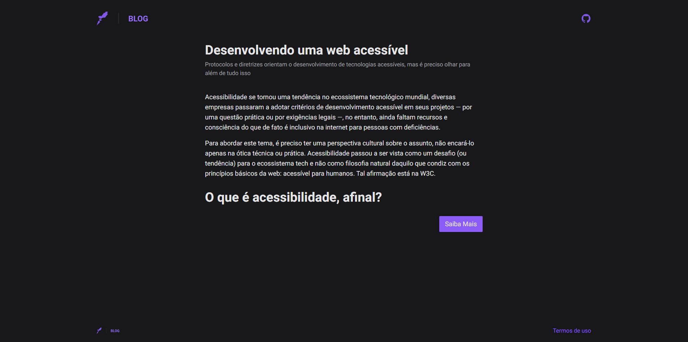

Status: Completo 🚀

## Acessibilidade
Um projeto voltado voltado a acessibilidade, aplicando os padrões da <a href="https://www.w3.org/TR/WCAG21/">WCAG</a>.

## Funcionalidades:
 * Home com tags semânticas do HTML

<hr/>
<br/>

<center>
 <div> 
<br/>
</center>
<br/>
<hr/>

## Tecnologias Utilizadas:

 * Next
 * TailwindCSS
 * Lucide React
 * prettier plugin tailwindcss
 * typescript

<hr/>

 ## Link do projeto no ar: <a href="https://curso-acessibilidade.vercel.app/">Acessar</a>
 
## Instalação
  * Faça um clone do repositório do projeto no GitHub.
  * Navegue até o diretório do projeto.
  * Execute o seguinte comando para instalar as dependências:

```
$ pnpm install
```

## Running the project
```
$ pnpm run dev
```
